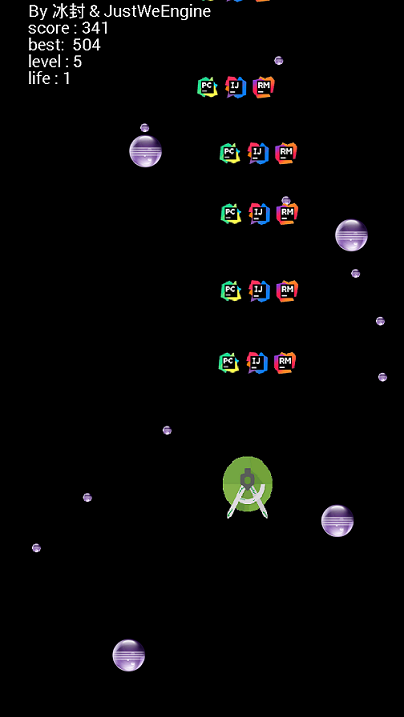
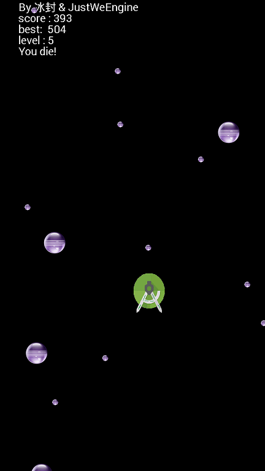
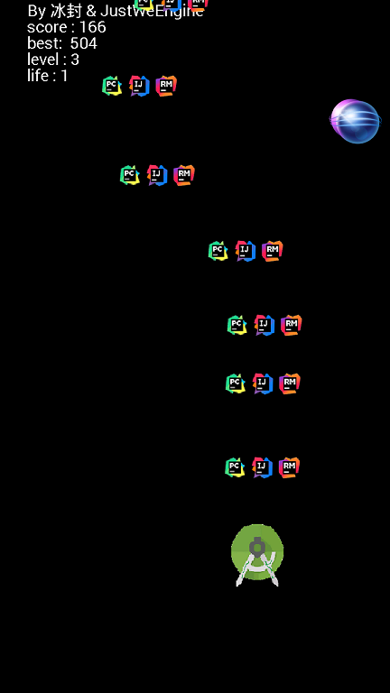
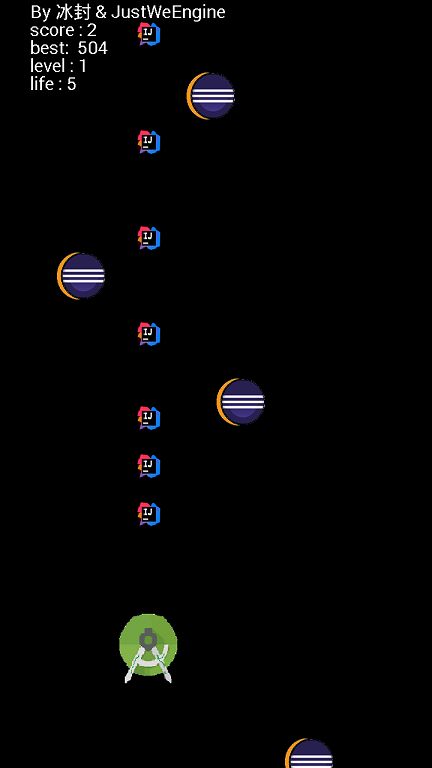
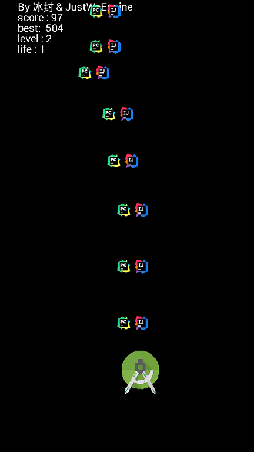
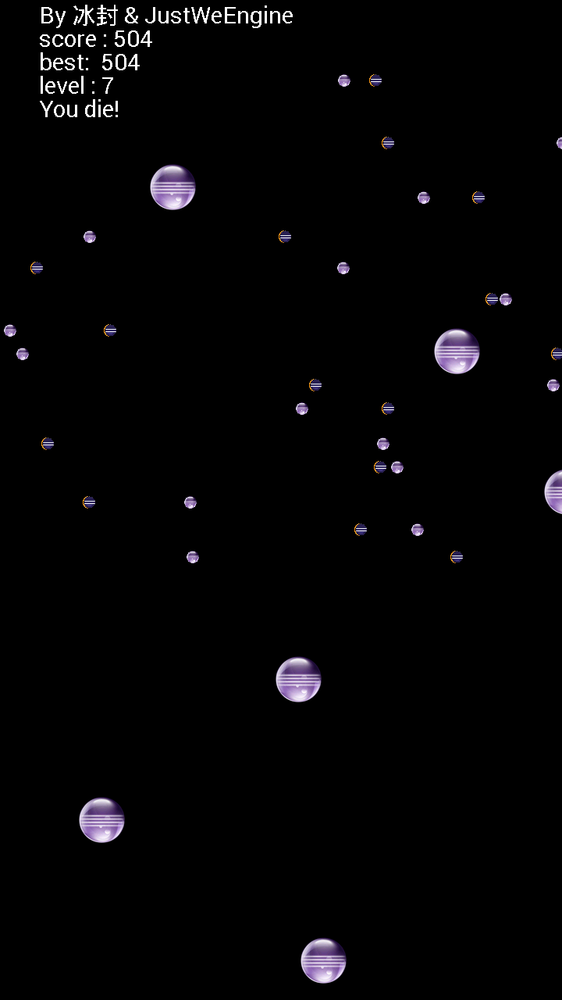

# StudioVSEclipse
AndroidStudio 大战 Eclipse 打飞机游戏 :joy:

# warning:
目前有个开启时极慢无比的bug，冰封正在努力调试中。。。 :joy:

#### Powered by [JustWeEngine](https://github.com/lfkdsk/JustWeEngine)
感谢[刘丰恺](https://github.com/lfkdsk)学长的指点 

## 简介
这是一个题材为 AndroidStudio 通过发射 JetBrains 系列的 IDE 来攻击各种版本的 Eclipse 的打飞机游戏。 :joy: 
后期可能加入Qt, VisualStudio, Unity, Unreal, Cocos等各大IDE。 
由于这是IDE之间的战争，冰封并不想加入各种编辑器，像npp, vim, emacs, sublime等，因为冰封爱好和平。 
欢迎bug反馈，欢迎issue。 
看呐，我用windows自带的画图工具制作的诡异的贴图： 

## 安装
1. 你需要一部Android手机，或者安卓虚拟机，并且它搭载Android4.0.3(API15)及以上的系统。
1. 下载[安装包](./app/app-release.apk)或克隆源代码并使用SDK编译。
1. 拷贝安装包到手机上 安装即可。

## 操作
1. AndroidStudio会和你的手指同步位移，而不是跟随你的手指，这样你可以将它任意移动。
1. 根据上面那条你可以知道，你是可以把角色移动到屏幕外面去的。
1. 每得到80分升一级，前面几级每次升级都会有新东西出现！

## 注意
1. 涉及游戏难度的计算都很诡异，因为冰封不是很会平衡游戏。
1. 后期难度逆天，请各位打飞机高手控制情绪，不要因为冰封而伤害自己的手机。
1. 游戏运行略卡，请忍受冰封那渣渣一样的优化能力！

## 截图
早期版本截图： 

